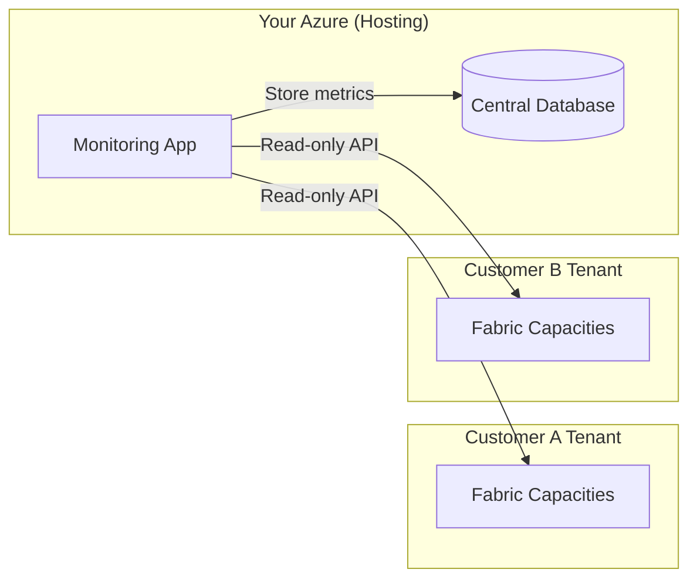

# Fabric Capacity Monitor

Open-source monitoring solution for Microsoft Fabric capacities. Built for consulting companies, Microsoft partners, and IT teams who need to monitor Fabric capacity metrics across multiple customer tenants from a single centralized platform.

[](https://portal.azure.com/#create/Microsoft.Template/uri/https%3A%2F%2Fraw.githubusercontent.com%2Fyaribouwman%2Ffabriccapacitymonitor%2Fmain%2Finfra%2Fmain.json)

## What It Does

Fabric Capacity Monitor collects and analyzes capacity metrics from Microsoft Fabric tenants. The infrastructure deploys:

- **Container App**: Hosts the backend API (containerized Python/FastAPI)
- **PostgreSQL Database**: Stores capacity metrics and time-series data
- **Key Vault**: Manages database credentials and customer secrets
- **Container Registry**: Hosts your application images
- **Private VNET**: Isolates the database from public internet access

Two deployment tiers available:
- **Starter**: Cost-optimized with scale-to-zero, burstable database
- **Enterprise**: Production-grade with HA, geo-redundancy, always-on replicas

## How It Works

The solution operates in a cross-tenant model:

1. **You deploy the infrastructure** to your Azure subscription (consulting company, partner, or internal IT)
2. **Your customers grant read-only access** to their Fabric capacity metrics via Service Principal
3. **Your app collects metrics** from all customer tenants and stores them in a centralized database
4. **Customers retain control** and can revoke access at any time



## Getting Started

Choose your deployment method:

**For smaller organizations or quick setup:**  
Click the "Deploy to Azure" button above. No command line needed.  
→ [Portal Deployment Guide](docs/deployment/portal.md)

**For IT teams and automation:**  
Use the CLI script for command-line deployment.  
→ [CLI Deployment Guide](docs/deployment/cli.md)

**For large organizations with DevOps:**  
Deploy with Bicep and CI/CD pipelines.  
→ [Enterprise Deployment Guide](docs/deployment/enterprise.md)

[View all deployment options →](docs/deployment.md)

## Customer Onboarding

Once your infrastructure is deployed, onboarding a new customer takes two steps:

### Step 1: Customer Grants Access (10 minutes)

Send your customer the appropriate setup guide:

- **English**: [onboarding/en/customer-guide.md](onboarding/en/customer-guide.md)
- **Dutch**: [onboarding/nl/customer-guide.md](onboarding/nl/customer-guide.md)

The customer guide provides three setup options:
- **Option A: Portal Setup** - Quick Azure Portal walkthrough (5 minutes, no tooling)
- **Option B: CLI Script** - Auditable bash script for repeatable setup
- **Option C: Bicep IaC** - Infrastructure-as-Code for enterprise change management

All three options create identical Service Principals with identical permissions.

**What customers do**: Create a Service Principal with Azure "Reader" role on their Fabric capacity, then send you 4 values (Tenant ID, Client ID, Client Secret, Subscription ID).

### Step 2: Add Customer to Your System (2 minutes)

```bash
cd backend/scripts
./add-customer.sh https://your-container-app-url.azurecontainerapps.io
```

The script will prompt for the 4 values from your customer, add them to your system, and generate an **Ingest Key** for optional Tier 3 metrics.

**Within 15 minutes**: Your monitoring system will start collecting capacity metadata automatically.

### Optional: Tier 3 CU Metrics

For detailed Capacity Unit (CU) utilization metrics:

1. Send your customer the pre-built notebook: [extract-metrics-notebook.py](onboarding/extract-metrics-notebook.py)
2. Customer deploys it in their Fabric workspace and schedules it every 15 minutes
3. Notebook pushes CU data to your monitoring API using the Ingest Key

**Benefits**: Long-term CU retention (beyond built-in 14-day limit), overload tracking, cross-customer utilization dashboards.

See [docs/onboarding.md](docs/onboarding.md) for a complete walkthrough with verification steps.

## Security Posture

This deployment follows Azure best practices for enterprise security:

### Identity & Access Management
- **Managed Identity**: User Assigned with least-privilege RBAC roles
  - Key Vault Secrets User (read-only secrets)
  - AcrPull (pull container images)
- **Admin API**: Protected by X-Admin-Key header (stored in Key Vault)
- **Customer Isolation**: Application-level filtering enforced on all endpoints
- **Custom RBAC Role**: `Fabric Capacity Reader` with only 3 required permissions (vs 7,501 in built-in Reader)

### Network Isolation
- **Database**: VNET-injected with no public endpoint
- **NSG Rules**: App subnet can only access database subnet on port 5432
- **Private DNS**: Database uses Azure Private Link for name resolution
- **TLS Required**: All connections use TLS 1.2+

### Secrets Management
- All secrets stored in Azure Key Vault
- Container App retrieves secrets via Managed Identity at runtime
- No secrets in deployment outputs or logs
- Admin API key auto-generated and never exposed

### Data Protection
- **Cross-Customer Access Prevention**: All queries validate customer_id against capacity_id
- **Cascading Deletes**: Foreign keys ensure data integrity
- **Comprehensive Testing**: Integration tests verify data isolation (see `backend/tests/`)

### Customer-Side Security
- **Scoped Access**: Service Principal permissions limited to specific Fabric Capacity resource
- **Least Privilege**: Custom role grants only read access to capacities and metrics
- **Instant Revocation**: Customers can remove access anytime via Azure RBAC
- **Audit Trail**: All API calls logged in customer's Azure Activity Log

### Compliance
- All resources tagged (Owner, Environment, CostCenter, Project)
- Soft delete enabled on Key Vault (7-day retention)
- Geo-redundant backups available (Enterprise tier)

**For complete security details**, see [docs/security.md](docs/security.md).

## Documentation

- [Deployment](docs/deployment.md) - Complete deployment guide for all methods (Portal, CLI, CI/CD)
- [Customer Onboarding](docs/onboarding.md) - Guide for adding customers to the monitoring system
- [Operations](docs/operations.md) - Day-to-day operations and maintenance tasks
- [Power BI Setup](docs/powerbi-setup.md) - Connect Power BI and build dashboards
- [Architecture](docs/architecture.md) - Component diagrams, network topology, cross-tenant data flows
- [Security](docs/security.md) - Complete security architecture, threat model, and best practices
- [Decisions](docs/decisions.md) - ADR-style records for key technical choices
- [Customer Guides](onboarding/README.md) - Customer-facing setup guides (English and Dutch)

## Development

This repository uses Cursor Rules for AI-assisted development. See `.cursor/rules/` for code standards.

Bicep modules are in `infra/modules/`. The orchestrator is `infra/main.bicep`.

## License

MIT

## Roadmap

**Completed**:
- Backend API for capacity metrics collection
- Multi-customer data isolation
- Azure VNET and Key Vault integration
- Customer onboarding automation

**In Progress**:
- Power BI report templates for capacity visualization
- Tier 3 CU metric ingestion via notebooks

**Planned**:
- Web UI for customer management
- Alerting and notifications (Teams, Slack, webhooks)
- Cost analysis and optimization recommendations

