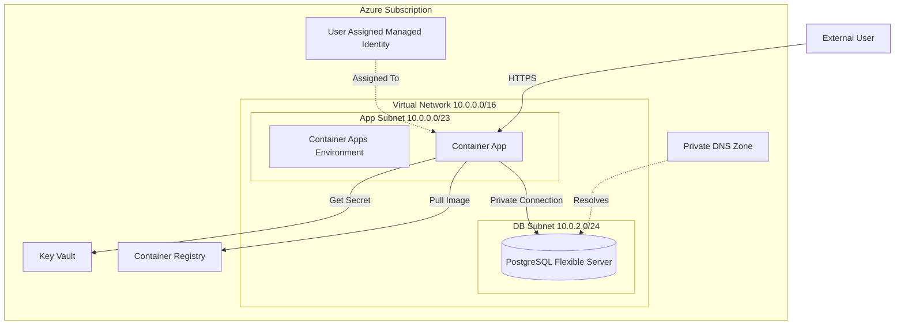
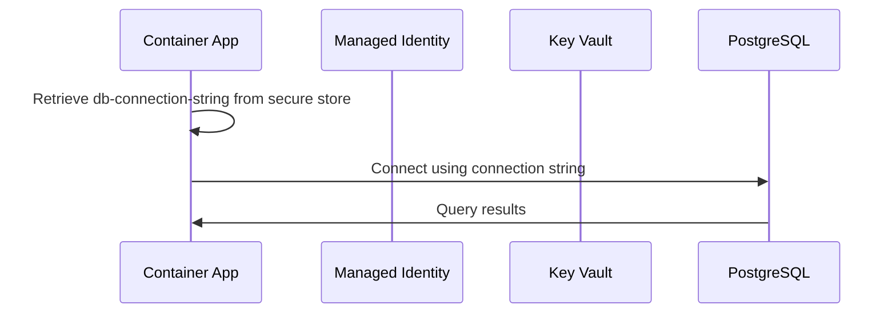
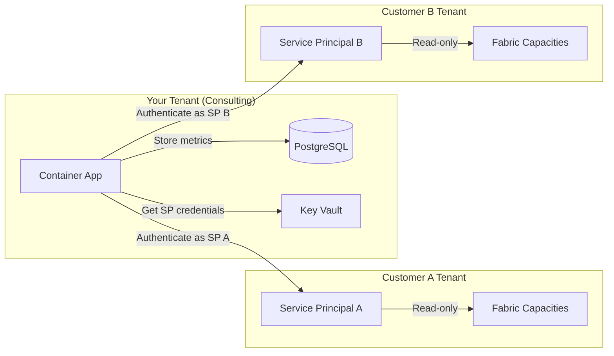
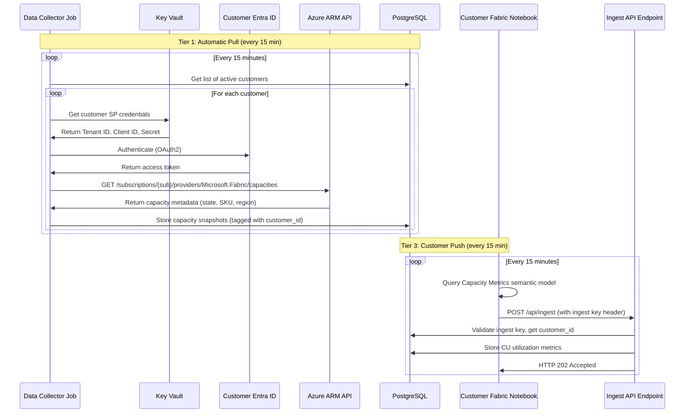

# Architecture

## System Overview

Fabric Capacity Monitor is a self-hosted monitoring solution for Microsoft Fabric capacities. The infrastructure deploys a containerized backend API that collects and stores capacity metrics in a private PostgreSQL database.

## Component Diagram



## Network Topology

The infrastructure uses a hub-and-spoke network design with isolated subnets:

- **VNET**: `10.0.0.0/16` provides the entire address space
- **App Subnet**: `10.0.0.0/23` hosts the Container Apps Environment (512 IPs)
- **DB Subnet**: `10.0.2.0/24` hosts the PostgreSQL server (256 IPs)

Both subnets have Network Security Groups with deny-all-inbound defaults. The database subnet only accepts connections from the app subnet on port 5432.

## Data Flow



## Cross-Tenant Data Collection

The monitoring solution operates in a cross-tenant model where the infrastructure is deployed in your Azure tenant, but it collects data from customer Fabric tenants.

### Multi-Tenant Architecture



### Service Principal Trust Model

Each customer creates a Service Principal in their own Entra ID tenant:

1. Customer creates an App Registration with no API permissions
2. Customer grants the Service Principal `Reader` role on their Fabric capacity Azure resource
3. Customer shares: Tenant ID, Client ID, Client Secret, Subscription ID with you
4. You store the Client Secret in your Key Vault (one secret per customer)
5. Your app authenticates as that Service Principal to call Azure Resource Manager APIs

### Hybrid Data Collection Flow



### APIs Called

The monitoring app uses these APIs for data collection:

| Tier | API Endpoint | Purpose | Data Returned | Permission Required |
|------|-------------|---------|---------------|---------------------|
| 1 | `GET https://management.azure.com/subscriptions/{sub}/providers/Microsoft.Fabric/capacities` | List capacities | Capacity ID, name, SKU, location, state | Azure `Reader` role |
| 1 | `GET https://management.azure.com/{resourceId}?api-version=2023-11-01` | Get capacity details | Properties, tags, provisioning state | Azure `Reader` role |
| 3 | `POST /api/ingest` | Receive CU metrics from customer | CU utilization %, overloaded minutes, throttling | Ingest API key |

**Tier 2 (Optional, not in MVP):**

| API Endpoint | Purpose | Data Returned | Permission Required |
|-------------|---------|---------------|---------------------|
| `GET https://api.fabric.microsoft.com/v1/admin/capacities` | List capacities | Capacity ID, name, region, SKU | Fabric Admin API setting enabled |
| `GET https://api.fabric.microsoft.com/v1/admin/workspaces` | List workspaces | Workspace ID, name, capacity assignment | Fabric Admin API setting enabled |

All endpoints are read-only. The Service Principal has no write permissions and cannot access:
- Actual data in lakehouses, warehouses, or semantic models
- Fabric artifacts (notebooks, reports, dashboards)
- Microsoft Graph data (users, emails, calendar)
- Azure resource creation or modification

### Customer Data Segregation

Customer data is isolated in the PostgreSQL database:

```sql
-- All metrics tables include customer_id for segregation
CREATE TABLE capacity_metrics (
    id BIGSERIAL PRIMARY KEY,
    customer_id UUID NOT NULL REFERENCES customers(id) ON DELETE CASCADE,
    capacity_id UUID NOT NULL REFERENCES capacities(id) ON DELETE CASCADE,
    collected_at TIMESTAMPTZ NOT NULL,
    metric_name TEXT NOT NULL,
    metric_value DOUBLE PRECISION NOT NULL,
    aggregation_type TEXT,
    INDEX idx_customer_time (customer_id, collected_at DESC),
    INDEX idx_capacity_metric_time (capacity_id, metric_name, collected_at DESC)
);

-- Row-level security ensures customers only see their own data
CREATE POLICY customer_isolation ON capacity_metrics
    FOR ALL
    USING (customer_id = current_setting('app.current_customer_id')::UUID);
```

## Trust Boundaries

### External Boundary
- Container App exposes a public HTTPS endpoint
- All other resources are private (no public endpoints)

### Internal Boundary  
- Container App can access Key Vault (RBAC: Key Vault Secrets User)
- Container App can access ACR (RBAC: AcrPull)
- Container App can access PostgreSQL (Network: App Subnet → DB Subnet)

### No Access
- Database has no public endpoint
- Direct secret access from outside the app is blocked
- All authentication uses Azure AD (Managed Identity), no credentials stored in code

## Scaling Configuration

Two deployment tiers adjust resource allocation:

| Resource | Starter | Enterprise |
|----------|---------|------------|
| Container App Replicas | 0-3 | 1-10 |
| Container CPU | 0.5 core | 2.0 cores |
| Container Memory | 1 GB | 4 GB |
| PostgreSQL SKU | Burstable B1ms | GP D2s_v3 |
| PostgreSQL Storage | 32 GB | 128 GB |
| PostgreSQL HA | None | Zone-Redundant |
| PostgreSQL Backup | 7 days | 35 days, Geo-Redundant |

The Starter tier optimizes for cost with scale-to-zero capability. The Enterprise tier optimizes for availability with always-on replicas and geo-redundancy.
